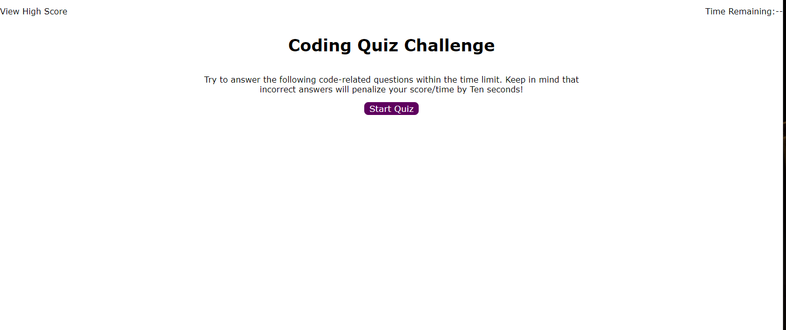
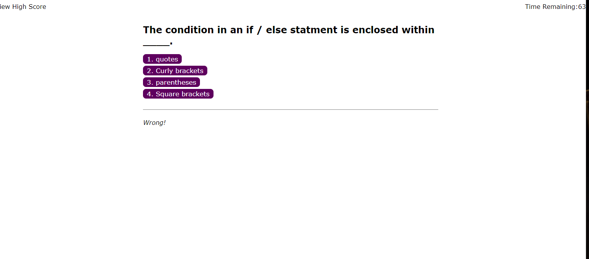
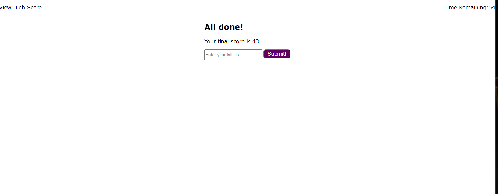
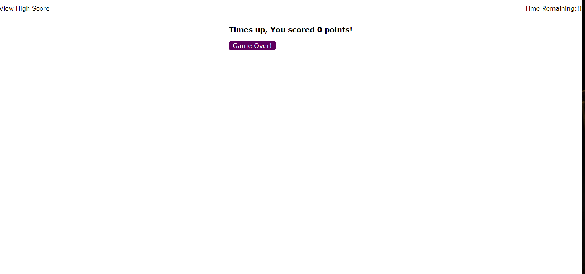
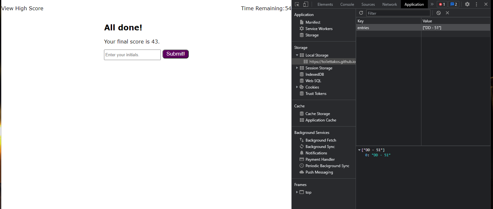
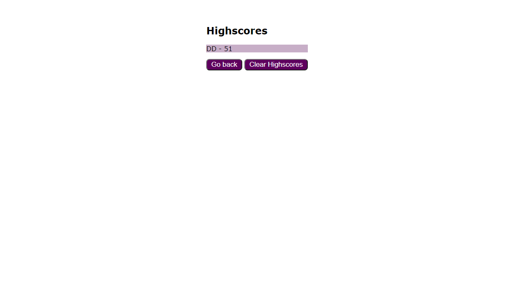

# JavaScript quiz game

# purpose
to test javascript skills as well as dom manipulation.

## process

* created initial start menu
* created displays for each section (questions, endgame, highscore and enter score)
* created questions and answer section as well as ability to move onto next question after answer was given
* created the timer and timer run out
* created score entry section with initials
* made it possible to store the entered score into the localstorage
* made it possible to pull the score to the highscore section
* can clear localstorage and highscore section

## links to repository and Deployed page
github repository: https://github.com/ToiletTakos/quiz-game
Deployed page url: https://toilettakos.github.io/quiz-game/

## screenshots

